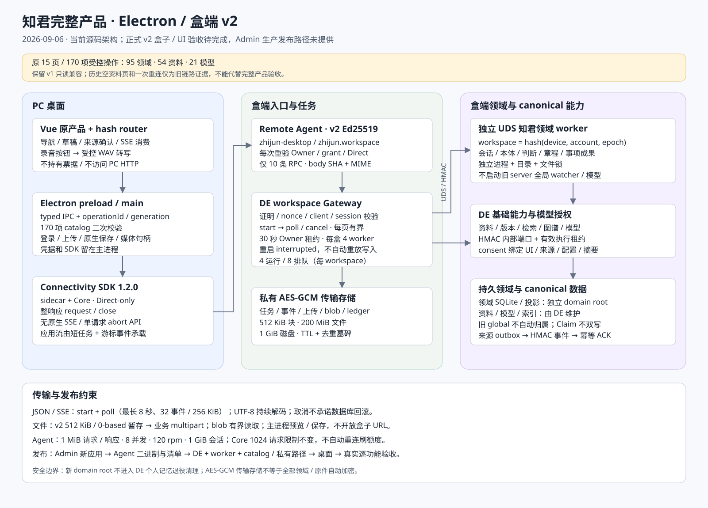
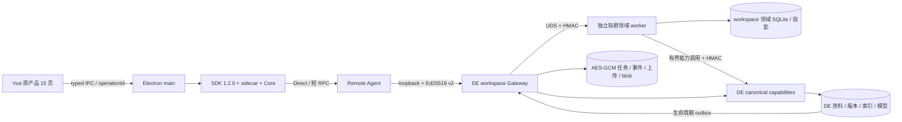

# 知君 Electron / 盒端完整产品架构

更新：2026-09-06。文件名保留 0905 以延续集成基线。本文描述当前源码；**v2 盒端Agent/DE/worker/catalog已正式匹配部署，完整Consumer/SDK/P2P/UI验收仍待完成**；Admin尚未生产发布，其发布路径未提供。不能把本地测试、170 项操作清单或菜单可见视为全功能验收。

配套：[集成与部署](INTEGRATION-0905.md)、[桌面合同](DESKTOP-CONTRACT-0905.md)、[领域集成](DOMAIN-INTEGRATION-0905.md)、[完整产品执行计划](FULL-PRODUCT-INTEGRATION-0906.md)、[正式验收记录](REAL-ACCEPTANCE-0906.md)。

## 1. 当前实现与历史证据

桌面已装配原产品 15 个页面组件、20 条页面路由和 2 条重定向，采用独立 hash router；保留五个主导航、偏好与原有直达页面。请求经共享 [product-operations.json](../../frontend/shared/product-operations.json) 的 170 项操作清单：95 项领域、54 项资料、21 项模型。清单规定操作 ID、方法、路径参数、query、body/response 类型与字节预算；它是有限业务词表，不是任意 HTTP 代理。

原 Web 入口继续使用本机开发后端。正式桌面使用新的 `zhijun-desktop / zhijun.workspace` 应用，经 SDK Direct 通道访问盒端 v2 Gateway，再由 Gateway 调用独立领域 worker 或 DE 能力适配器。renderer 不启动 Python，也不请求 PC 本机 HTTP。

历史 v1 `mindos-person-data-pc / person-data.read` 保留原行为。家中盒子此前已验证真实登录、授权空资料页、刷新和一次断开重连；尚缺非空资料和完整跨主体矩阵，不能据此宣称 M0-R 或 v2 完成。历史部署见 [BOX-DEPLOYMENT-0906.md](BOX-DEPLOYMENT-0906.md)。2026-09-06 的连接 FD 泄漏修复已单独部署，见 [故障记录](../reports/CONNECTIVITY-FD-HOTFIX-0906.md)；该热修是历史独立修复；后续v2盒端匹配部署已完成，仍不等于完整产品验收。

## 2. 运行单元与责任

| 单元 | 当前职责 | 边界 |
| --- | --- | --- |
| Vue renderer | 原页面、草稿、来源授权交互、SSE 消费、受控录音 | 只使用 preload 产品接口；不读取票据、模型密钥、盒端路径 |
| Electron preload / main | IPC 验参、generation、登录/设备选择、operation policy、上传/下载/保存、媒体句柄、麦克风授权 | main 独占真实 SDK 和凭据；清单外操作拒绝 |
| Connectivity SDK 1.2.0 | Electron sidecar、Core、Direct 会话与整响应 request/close | 没有原生 SSE/流式 chunk/逐请求取消 API |
| Consumer / Gateway / Admin | 账号、设备 Owner、应用 grant、ticket、信令 | 新应用单独登记；不扩大旧 person-data.read 权限 |
| 盒端 Remote Agent | Direct/Owner/grant/session 每次重验、10 条 v2 RPC 路由、Ed25519 证明 | 不向 renderer 暴露签名密钥，不允许透传原 `/api/**` |
| DE zhijun_gateway | 验签/nonce、workspace/client/session 绑定、短任务队列、加密事件与文件分片、worker 租约 | 不信任 PC 自带身份头；不自动重放不确定写入 |
| 知君 UDS worker | 会话、本体、判断、章程、事项/成果、建档、学习、附件领域逻辑 | 每个 workspace 独立进程/数据根/锁；不运行原 server 全局 watcher/Chroma/模型 |
| DE zhijun_capabilities | canonical 资料、目录、版本、检索、图谱、模型及本地转写 | 来源/隐私/生命周期持续校验；不复制第二套索引或模型设施 |

## 3. 数据与身份边界

`workspaceId = SHA256(compact JSON [deviceId, accountId, ownershipEpoch])`，结果为 64 位小写十六进制。领域持久目录按此 ID 分区；存储 scope 为 `zhijun:v2:<workspaceId>`。这是所有权代次隔离，不是可由 renderer 指定的目录或数据库参数。worker 根有 `.workspace.json` 主体标记及文件锁，拒绝不匹配的身份和未分配的非空旧目录。

临时任务、上传和 blob 进一步绑定真实 clientId；任务保留创建 sessionId。同 client 的新 session 只有显式重复 start 才可恢复已记录结果，不因此重启旧运行任务。每次 poll/chunk/cancel/blob read 重新授权。退出、设备切换和代次改变清除客户端资源；持久数据不会因为退出被重分配。

知君 ontology 是知君个人理解的事实源；DE 可选 Claim 域保持独立，不自动双写。事项/成果不是 Claim。旧 global 资料不归首次登录者，DE 个人记忆退役清理也不能扫描新的 domain root。Gateway AES-GCM 保护的是任务载荷、事件、文件块和内部 ledger；**领域 SQLite 与 canonical DE 原件不因此自动获得同样的加密承诺**。

## 4. 三类数据通道

### 4.1 JSON 与聊天流

主进程把清单操作编码为 `POST /api/mindos/zhijun/operations`，取得 job ID 后，以 `after/waitMs` 有界轮询。DE 确实执行任务并持久化事件；worker 原 SSE 被转成 `headers/chunk/end/error` 事件，renderer 适配为 ReadableStream 供原 SSE 解析器使用。UTF-8 解码跨块保留状态。

这实现应用层流体验，SDK 本身仍等待每次短 RPC 的完整响应。单次 poll 最长 8 秒、每页最多 32 事件/256 KiB，避免把长聊天放进 SDK 15 秒 watchdog；任务总时长上限 600 秒。取消是显式服务端动作，不能等同数据库回滚。断线、崩溃或超时后的写入结果可能不确定，禁止自动改 requestId 重做。

### 4.2 附件、导入、下载与预览

传输层上传是 v2 暂存：512 KiB 原始字节、0-based index、JSON base64+SHA256；完成时校验整文件 SHA256。业务 operation 引用完成 uploadId，由盒端还原 multipart，保留资料版本、对话附件保护与原字段。它与 DE 历史 Pocket `parts/complete` 1 MiB、1-based 协议不是同一层。

二进制业务响应生成加密 blob，事件仅含描述；主进程有界读取或在本地保存对话框确认后写文件。预览用主进程控制的 `zhijun-media:` 句柄，不暴露盒子 loopback URL。完成上传在没有活跃任务引用后可显式释放，重复 DELETE 幂等；小去重墓碑继续保留。单文件最多 200 MiB，传输会话和 workspace 磁盘各 1 GiB；两者是不同预算。main统一调度心跳、poll与上传并预留请求/编码后字节；真实JS+严格内存Agent的虚拟时钟测试完成400块/243秒、滚动60秒最多101请求，但实际SDK/P2P大文件传输尚未验证。

### 4.3 语音与模型

录音必须由明确按钮触发，经聚焦的可信主 frame、当前 generation 和操作系统授权；只允许 audio，拒绝 camera/display capture。录音最长 120 秒，renderer 转为 16 kHz/PCM16/单声道 WAV，再走受控文件和 `voice/transcribe` 操作。DE 本地转写只返回文字，结果填入草稿，不自动发送消息或注册资料。盒端 voice API 已用合成 WAV 实测返回40字符、0条资料，两个指定短语均匹配；真实麦克风与正式SDK/UI仍需实测。

模型配置与 Key 留在 DE；worker 使用 HMAC 内部能力协议。外发 consent 绑定真实 UI 授权、preview revision、源对象及版本、配置 revision、服务/用途和请求摘要；无来源的提示词也不能跳过确认。模型流使用盒内有界 NDJSON，不能从 renderer 开放任意模型 URL。后台任务不能自行签发前台 consent。

## 5. 生命周期与故障恢复

Gateway 每盒最多 4 个 worker，每工作区最多 4 个运行任务、8 个排队任务；有效 Owner 请求续租，租约 30 秒，桌面心跳 10 秒。worker 不继承 DE 数据路径、模型密钥、PYTHONPATH 或 local-debug 设置。租约失效、撤销或退出后停止相关执行；服务重启把未完成 Gateway 任务标记 interrupted，不自动重放写入。

canonical 资料事件通过持久 outbox 进入 Gateway；Gateway 仅在有效租约下向 `/v1/events` 发 HMAC 请求。来源事件处理保持幂等并在成功后 ACK，撤销/删除后使受影响理解、投影与授权失效。调度 tick 是固定内部事件，不是 renderer 可自由提交的业务操作。

部署配置、路径权限和顺序见[集成方案第 5 节](INTEGRATION-0905.md#5-部署配置与顺序)。正式发布需固定 Admin、Agent、DE、worker、catalog、桌面和 sidecar 版本；当前盒端匹配发布已固定为知君 `735e341`（代码 `58dac31`）、DE `015c659`、OS `5f5f4c9`；Admin发布输入缺失，正式Consumer/SDK/P2P/UI验收待完成。

## 6. 关键源码索引

- 桌面：[desktop/router.ts](../../frontend/mindos-web/src/desktop/router.ts)、[productClient.ts](../../frontend/mindos-web/src/desktop/productClient.ts)、[transport.ts](../../frontend/mindos-web/src/services/transport.ts)。
- 宿主：[desktop-runtime.cjs](../../frontend/shell/runtime/desktop-runtime.cjs)、[product-session.cjs](../../frontend/shell/runtime/product-session.cjs)、[product-policy.cjs](../../frontend/shell/runtime/product-policy.cjs)、[产品类型](../../frontend/shared/product-contract.ts)。
- 领域：[worker 装配](../../backend/zhijun_worker/app.py)、[workspace](../../backend/zhijun_worker/workspace.py)、[能力端口](../../backend/zhijun_worker/capabilities.py)、[事件](../../backend/zhijun_worker/events.py)。
- 跨仓：DE `backend/mindos/zhijun_gateway/{protocol,catalog,store,workers,manager}.py` 与 `zhijun_capabilities/`；Agent `remote-agent/internal/{mindosbridge/workspace,p2p/workspace_bridge}.go`。
- 机器可读边界：[v2 合同](contracts/zhijun-workspace-v2.json)、[v1 合同](contracts/mindos-bridge-v1.json)。跨仓当前工作树、部署提交和证据以[正式验收记录](REAL-ACCEPTANCE-0906.md)为准。

## 7. 硬件复测的当前边界

隔离真盒PDF/DOCX/OCR分别提取46/48/110字符，voice API已通过；小文档内联快照SHA、DeletionStore连接释放及有界纠错修复后，hardware-candidate5完整5/5：safe material正文82、摘要43字符、实体2、关系0。gateway-candidate6为10/10、60请求/21个completed操作，知识CRUD/confirm/search/purge通过。以上均为合成主体/输入，不代表正式Consumer/UI/SDK验收完成；生产Admin发布入口仍缺。源码修复与配额证据见[审核报告](../reports/FULL-PRODUCT-GATEWAY-REVIEW-0906.md)，硬件现场结果见[硬件报告](../reports/FULL-PRODUCT-HARDWARE-0906.md)。

正式盒端匹配部署的版本、备份、文件哈希、健康与拒绝检查见[部署回执](../reports/FULL-PRODUCT-DEPLOYMENT-0906.md)；Admin发布及正式Consumer/SDK/P2P/UI验收保持独立待办。

### 连接失败时的应用框架

账号登录态负责显示导航框架，工作区 `ready` 状态负责挂载业务内容。连接失败时五个导航与偏好仍可见，内容区显示连接恢复操作；业务页和旧工作区状态卸载。账号票据签发错误与原生设备连接错误在主进程分别分类，不能由统一 `TRANSPORT_UNAVAILABLE` 推断设备离线。见[桌面合同补充](DESKTOP-CONTRACT-0905.md)。
