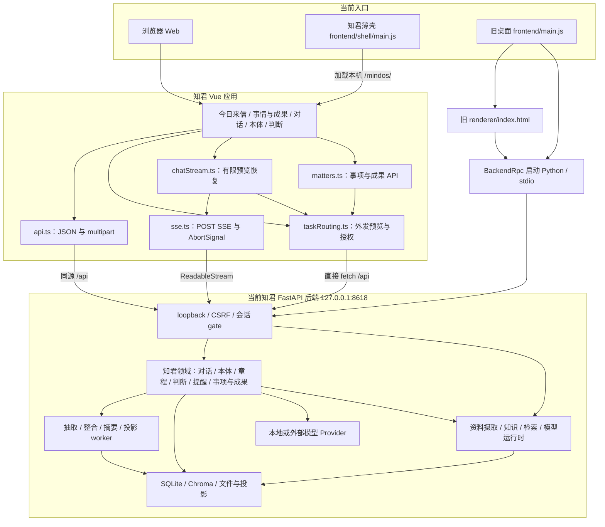
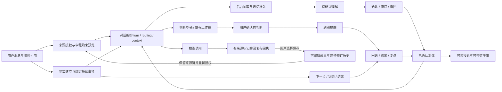
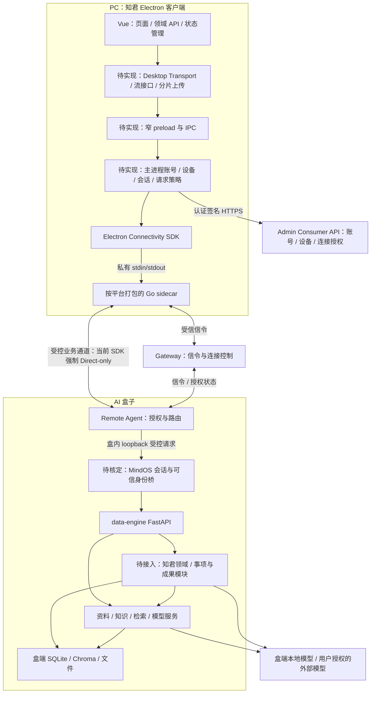
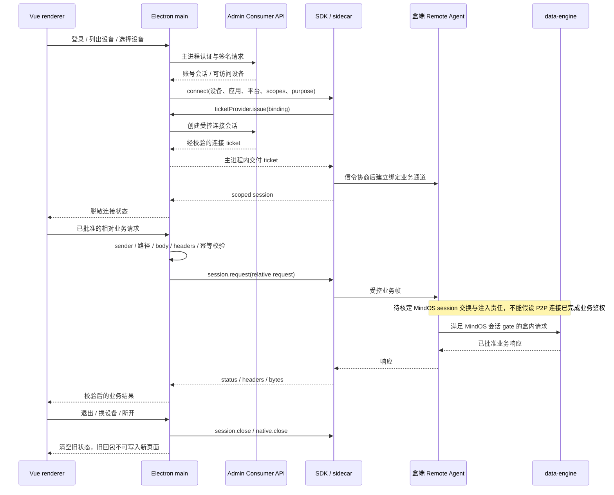

# 知君当前架构与 Electron / data-engine 目标架构

日期：2026-09-05（已同步产品源 `22dc9a3` 后复核）。本文基于本地源码调研，配套实施步骤见 [集成方案](INTEGRATION-0905.md)，原审核见 [审核记录](REVIEW-0905.md)，本次变更和验证见 [上游同步记录](UPSTREAM-SYNC-0905.md)。图中标注「待实现」的部分是建议设计，不代表现有能力。

可直接打开或用于评审的 [目标架构 SVG](assets/architecture-0905.svg) 已从第 5 节 Mermaid 图导出；第 3、4、5、6 节分别为当前架构、业务关系、目标部署和连接时序。

## 1. 结论

知君是带专属领域后端的完整应用。Vue 前端之外，它还包含对话编排、记忆准入、来源授权、本体确认、判断、章程、回访和投影等服务。本次新增跨对话的持续事项、可编辑成果与历史记录，它们不自动成为个人 Claim。当前 data-engine 提供资料与知识基础能力，但没有兼容这些知君领域的路由；它另有可选 Claim/Profile 域，需要先界定与知君本体的事实源。Electron SDK 解决受控连接和请求传输，不补齐业务接口，也没有现成的逐帧聊天流接口。

建议目标是：**PC 运行知君 Vue + Electron 宿主；身份与设备连接由主进程管理；数据和模型在盒子；知君领域模块在盒端接入 data-engine。** 第一阶段可先完成已有资料 API 的闭环，完整知君体验依赖领域接口与流式能力补齐。

这里的「知君领域模块接入 data-engine」是架构建议：优先作为盒端同一服务内的独立模块，复用资料、检索、模型与存储设施；若最终采用独立进程，应另定义盒内服务 API、认证和 Remote Agent 路由，不能把两个同源后端直接指向同一数据目录。

## 2. 现有三个工程的职责

| 工程 | 当前实际内容 | 集成中的职责 |
| --- | --- | --- |
| `nexusaos-centuarai-zhijun` | Vue 3 / TS / Vite；知君 Electron 薄壳；旧 Electron 应用；完整 FastAPI 后端 | 产品页面、交互及知君领域逻辑的来源 |
| `nexusaos-centuarai-conn-sdks` | 合同、Electron 主进程 facade、认证刷新助手、sidecar 桥、桌面配网包 | 受控连接能力；不承载知君业务或任意 URL 代理 |
| `nexusaos-data-engine` | 盒端资料/知识/检索/模型服务；已有远程 Electron 客户端参考实现 | 盒端基础数据能力和宿主集成参考；不能直接替代知君后端 |
| 外部依赖：Admin / Gateway / Remote Agent / OS Core | 账号与设备授权、信令和连接执行、盒端能力转发、Go 传输实现 | 端到端联调不可缺少；本轮没有修改或部署这些系统 |

二次审核时 SDK / OS 工作区已干净，HEAD 分别为 `819831c` / `9f7354e`；data-engine 仍有未提交修改。现有 sidecar manifest 仍记录旧提交 `a13d7e5` 加 dirty 源码，不能将其等同当前 OS HEAD；完整版本基线见集成方案。

## 3. 知君当前架构



三处容易误判的现状：

1. README 推荐的知君桌面是 `frontend/shell`，只打开后端页面，没有 preload。根 `start-desktop.sh` 却进入 `frontend` 启动上一代应用，后者启动 Python 并加载旧 UI。集成时必须统一入口。[Z1] [Z2]
2. `api.ts`、`sse.ts`、`taskRouting.ts` 各自有网络调用；只替换 `api.ts` 会留下 SSE 和授权路径直连。旧票据桥还会将 ticket 投放到 renderer，与新 SDK 的主进程持有边界不同。[Z3] [Z4] [Z5]
3. 现有 Vue 用 `/mindos/` history 路由及绝对资源 base；改为 Electron 本地资源加载时，需要独立 desktop 构建和 hash 路由或受控应用协议，不能直接 `loadFile(dist/index.html)` 后假定可用。[Z6]

新增 `matters.ts` 复用 `routingRequest`；`chatStream.ts` 编排预览与 SSE，没有新增第四套传输。它只在尚未收到事件、命中特定 409 且用户未取消时重新预览一次，并复用 requestId；不自动重放来源变化、500、断网或已开始的流。`backendConnection` 的 Web 后端状态也不是 SDK 连接快照，桌面接入需映射到主进程状态。[Z14] [Z15]

## 4. 知君业务内部关系



| 领域 | 实现位置 | 需要保留的行为 |
| --- | --- | --- |
| 对话与流 | `backend/mindos/conversations.py`、`zhijun/turn.py` | 用户/助手消息、首帧错误与流内错误、`requestId` 重试、终止后的 aborted 状态 |
| 外发授权与章程 | `routing_routes.py`、`zhijun/routing.py`、`zhijun/charter.py` | 预览 revision、引用授权、localOnly、明确同意与审计；不能因接远程盒子就绕过模型外发选择 |
| 本体与记忆 | `ontology.py`、`memory_routes.py`、`zhijun/extract.py`、`zhijun/jobs.py` | 候选、确认、证据、撤回、整合；PC 不成为另一份事实源 |
| 判断与提醒 | `growth.py`、`nudges.py`、`zhijun/deliberate.py` | 判断草稿、确认、回访、结果、提醒状态 |
| 对话附件 | `chat_import_routes.py`、`chat_imports.py` | 上传批次、文件版本、对话归属、隐私保护和授权；不等同于普通文件上传 |
| 持续事项与成果 | `matters_routes.py`、`stores/matters_store.py`、`context_sources.py` | 事项与会话绑定分开修订；成果来自完整回复，编辑不解除来源限制；不自动写成长期 Claim |
| 数据落盘 | `runtime_paths.py`、`mindos/stores/` | ontology / conversations / growth 数据库，以及 routing、chat-import 等关联表和 memory 投影 |

上述领域路由在 [server.py][Z7] 注册；[对话执行与 SSE][Z8]、[本体路由][Z9]和[运行时路径][Z10]是阅读主线。原 `zhijun-api-contract.md` 是早期接口契约，实施时仍须以当前路由及前端类型逐项校对，尤其是后续增加的 routing、learning、附件与章程工作区。

迁移边界不止领域目录：知君在基础 `qa.py` 中排除受保护附件及其衍生知识卡，聊天授权不会自动开放普通 RAG；在基础 `uploads.py` 中于新版本摄取前继承隐私保护。data-engine 尚未接入这些扩展点，必须先提取保护策略并接入基础服务。ChatImportStore 与会话库、RoutingStore 与本体库还共享事务/锁；schema 迁移、唯一 worker 注册和重启恢复属于领域迁移的一部分，详见集成方案第 5.2 节。

图中的投影是业务概念，不代表所有输出都按设备落盘：现有 `USER.md` / `ZHIJUN_PROFILE.md` 仅写 global，设备投影通过 API 动态渲染；context-pack、实体合并、立即整合、全部清除等接口仍有 global-only 限制。远程设备支持需另列能力清单。[Z11] [Z12]

新增 `work_matters / work_matter_bindings / work_artifacts / work_actions` 落在 `ontology.db`，借用同一连接与锁；历史含正文快照。事项/成果列表和历史暂未分页，旧本体 purge 未清这些表，删除原对话也不等于删除成果副本。需要单独定义响应预算、保留/删除及 owner/device 规则，不能沿用“本体全量清除”概括新增数据。[Z16]

## 5. 建议目标部署架构



图中没有将 PC 的 `127.0.0.1:8618` 作为正式依赖。该地址在目标部署中属于盒内 data-engine；本地 Web 开发可以保留独立入口，但桌面断连时不得回退到本机旧数据库。[D1] [D2]

### 5.1 责任与数据归属

| 层 | 持有内容 | 不应向下一层开放的内容 |
| --- | --- | --- |
| Vue renderer | 页面状态、脱敏账号/设备信息、业务对象、非秘密连接状态 | 不持有 refresh token、客户端签名私钥、连接 ticket 或任意宿主文件路径 |
| preload / IPC | 已审核的请求、事件订阅、关闭/取消标识 | 不提供通用 `fetch(url)`、任意 channel、任意进程启动能力 |
| Electron main | 安全凭据适配、Consumer 客户端、设备选择、session 生命周期、请求与响应策略 | 不把完整 SDK host、sidecar、ticket 返回 renderer |
| sidecar / Remote Agent | 信令、传输、绑定校验与批准业务路径 | 不把“连通”解释为可访问盒内全部 HTTP 接口 |
| data-engine + 知君领域 | 文档、知识、本体、对话、判断、记忆准入、模型调用 | 不与 PC 建立未定义的双写或自动同步事实库 |

切换设备/账号必须先使旧请求代次失效、取消/关闭旧执行、清除页面数据和对象 URL，再建立新会话。Composer 与章程编辑器还保存包含正文的 sessionStorage 草稿，当前键没有账号/设备维度，必须补归属与保留规则。现有 `sessionGate.ts` 只提供局部请求代次工具，不能据此认定整个应用已具备设备级隔离。

服务端也须补归属：当前 data-engine 的 folders/计数/目录删除未按设备隔离，资料只读首轮不能直接透出这些字段。`device:<deviceId>` 不区分同盒账号，而可选 Claim 域另按 owner + device 保存；设备共享与转让、个人画像归属须先定合同。架构图表达目标责任，不代表这些隔离条件已实现，证据和验收见集成方案第 5.3 节。

### 5.2 推荐模块布局（全部是拟新增或拟调整）

```text
frontend/
  shell/                         # 保留为知君唯一桌面宿主包
    main.js                      # 窗口、连接生命周期、退出回收
    preload.cjs                  # 窄 IPC bridge
    electron/
      consumer/                  # 账号与设备 API、安全凭据适配
      connectivity/              # SDK 装配、会话、请求/响应策略
      security/                  # renderer 来源、CSP、sidecar 校验
  mindos-web/
    src/main-desktop.ts          # 先登录/选择/连接，再进入业务路由
    src/router/desktop.ts        # 桌面路由；连接就绪前不调用建档 API
    src/services/transports/     # Web 与 Desktop 显式分离
    src/services/api.ts          # 现有领域类型与方法逐步复用
    src/services/sse.ts          # 依赖统一 stream 端口
    src/services/taskRouting.ts  # 接统一 request 端口
    src/services/chatStream.ts   # 保留有限重预览与requestId，不重放已开始的流
    src/services/matters.ts      # 新事项/成果DTO与revision，仍经统一request端口
    dist-desktop/               # 独立生成产物
```

`frontend/shell` 的包边界和打包白名单须明确包含构建好的 `dist-desktop`，不能把整个仓库、旧 renderer 或 Python 依赖打进 PC 包。data-engine 已有类似的独立构建和包边界测试，可提取模式并适配知君页面，不直接覆盖其产品 UI。[D2] [D3]

## 6. 连接与业务请求时序

以下描述正式 SDK 连接路线。现有知君 `__MINDOS_ACCESS__.getTicket()` → `X-MindOS-Session` 是另一条旧路线，不混用。



## 7. 两个必须单独设计的通道

**聊天流。** 当前 SDK `ElectronScopedSession.request()` 返回一次完整 `Uint8Array`，只提供 `request/close`，不能直接承载知君 `ReadableStream` 的逐帧交互。Agent 已发送 response chunk，但 Core 缓冲到 end 才返回；应扩展现有分帧协议，在 Core、sidecar、SDK、Agent、主进程与 preload 间补全 stream/cancel/backpressure。另一选择是持久任务 + 游标轮询，两者均待实现。当前普通切页会让生成继续落库，用户明确停止才取消，新会话管理器需保留这一区别。[S1] [Z4] [Z13] [O1]

**上传与媒体。** SDK 请求体上限为 2 MiB；知君当前 multipart（普通资料、资料新版本、对话附件）不能统一原样转发。data-engine 有分片上传与受控文件读取实现可参考，但当前前后端分片路由存在漂移，不能直接使用；对话附件还包含批次、版本与隐私保护语义。页面中的 `previewUrl` 也不能直接指向盒子 loopback：应通过受控下载得到 bytes/Blob/object URL，并对大小、类型、回收及可能的 Range 能力逐项验证。[S2] [Z3]

两个通道还共享会话预算：当前参考 PC Agent 配置为 8 并发、120 请求/分钟、64 MiB 请求/响应 body 总量；Core 每 session 最多 1,024 次请求，Core/Agent 默认 HTTP 总时限 60 秒。分片不自动解决整场流量限制，轮询也不能无限发送；详见集成方案第 4.4 节。这些是参考配置，知君正式身份须独立确认额度。[O2]

## 8. 关键源码索引

链接使用同级工作区布局；`Z` 指本工程，`D` 指 data-engine，`S` 指 SDK。

[Z1]: ../../frontend/shell/main.js#L1
[Z2]: ../../start-desktop.sh#L1
[Z3]: ../../frontend/mindos-web/src/services/api.ts#L1
[Z4]: ../../frontend/mindos-web/src/services/sse.ts#L1
[Z5]: ../../frontend/mindos-web/src/services/taskRouting.ts#L34
[Z6]: ../../frontend/mindos-web/src/router/index.ts#L1
[Z7]: ../../backend/server.py#L1233
[Z8]: ../../backend/mindos/conversations.py#L344
[Z9]: ../../backend/mindos/ontology.py#L397
[Z10]: ../../backend/runtime_paths.py#L1
[D1]: ../../../nexusaos-data-engine/README.md#L5
[D2]: ../../../nexusaos-data-engine/frontend/mindos-web/vite.config.ts#L1
[D3]: ../../../nexusaos-data-engine/frontend/package.json#L1
[S1]: ../../../nexusaos-centuarai-conn-sdks/packages/connectivity-electron/src/index.ts#L19
[S2]: ../../../nexusaos-centuarai-conn-sdks/packages/connectivity-contracts/src/index.ts#L57
[Z11]: ../../backend/mindos/zhijun/projection.py#L93
[Z12]: ../../backend/mindos/ontology.py#L81
[Z13]: ../../frontend/mindos-web/src/pages/ConversationPage.vue#L1160
[O1]: ../../../nexusaos-centuarai-os/p2p-core-go/http.go#L255
[O2]: ../../../nexusaos-centuarai-os/manifests/remote-agent-applications.yaml#L25
[Z14]: ../../frontend/mindos-web/src/services/chatStream.ts#L1
[Z15]: ../../frontend/mindos-web/src/services/matters.ts#L1
[Z16]: ../../backend/mindos/stores/matters_store.py#L1
