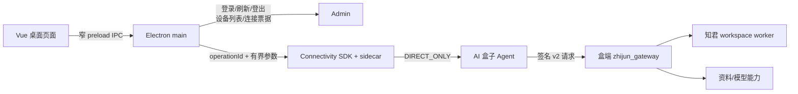

# 桌面接口去向与本体首屏复核（2026-09-07）

## 结论

当前 Electron 正式模式的网络边界已按预期接入：账号和设备控制请求访问 Admin；知君产品业务请求全部进入 Connectivity SDK 的 Direct 会话，再由 AI 盒子的 v2 Gateway 执行。renderer 不直接访问 Admin、盒子 IP、localhost 或第三方 URL，也不会在桌面产品通道缺失时回退到浏览器 `fetch`。

这项结论证明 170 个白名单操作都只能走盒端受控通道，不等于 170 个操作已经用正式账号逐项真机执行。当前真机已覆盖生产登录、设备列表、票据、Direct、workspace context、首页与“我的本体”读取等关键链路；剩余写入、长流、上传、模型、撤销及跨主体场景继续按完整验收矩阵执行。

## 接口分工

| 范围 | 实际去向 | 说明 |
| --- | --- | --- |
| 密码登录、Token 刷新、退出登录 | Admin | Consumer client 管理账号会话，凭据不进入 renderer |
| 已绑定设备列表 | Admin | `deviceName` 投影为公开 `displayName`；名称缺失时回退 `deviceId` |
| Connectivity session / ticket | Admin | 绑定 `zhijun-desktop`、`zhijun.workspace`、`remote.p2p` |
| 会话、本体、判断、章程、事项、资料、知识、搜索、图谱、设置和监控 | AI 盒子 | 原 `/api/...` 请求先解析为共享 catalog 中的固定 operationId |
| 聊天 SSE | AI 盒子 | 盒端 job 事件由桌面恢复为 renderer 的 `ReadableStream` |
| 上传、原件、媒体 | AI 盒子 + 本地 Electron | 数据经盒端分片接口；预览只开放 `zhijun-media://`，保存使用系统对话框 |
| 麦克风授权、加密凭据、保存对话框、少量视图偏好/草稿 | 本机 | 属于操作系统或隔离 UI 状态，不是远程业务 API |
| Ollama / 外部模型 | 盒端 DE | 设置页只把配置发给盒子，renderer 不直接调用模型地址 |

共享 [product-operations.json](../../frontend/shared/product-operations.json) 当前有 170 项：domain 95、materials 54、models 21；62 项读取、108 项写入；167 项 JSON、1 项 SSE、2 项 bytes。`productCatalog.ts` 对 method、path、path 参数、query、body 类型和字节预算做精确匹配，清单外请求拒绝。

## 盒子名称修复

原问题是 Admin 设备列表已有名称，但连接后的公开 snapshot 只保留 `deviceId`。现在 runtime 在用户选择设备时保存经过校验的 `displayName`，通过 `subject.deviceName` 提供给 renderer；顶部显示去除首尾空格后的名称，只有名称为空或旧 snapshot 没有该字段时才显示 ID。断开、失败和退出会同时清除设备 ID 与名称，避免切盒后残留。

真实重启后已连接公司盒子，顶部显示 `AMD-A2A-248`，不再显示截断的设备 ID。模板端到端测试同时覆盖“名称优先”，纯函数测试覆盖空白名称和缺失名称回退 ID。

## “我的本体”首屏优化

默认摘要原来挂载时并发读取 stats、当前分区 200 条 claims、摘要使用的 1000 条 claims。模板实际只使用最后一项，所以会产生 3 个盒端业务任务；每项至少需要一次 start 和一次 poll，即最低 6 次 SDK HTTP。30 秒导航提示缓存未命中时还会增加 onboarding 的 start/poll。

现在按当前视图加载：

- 摘要只读取摘要 claims；
- 切到全景时再读取 stats；
- 切到列表或 inbox 时再读取分区 claims 和 stats；
- 已成功读取的空摘要也会标记完成，摘要/全景来回切换不会因数组为空而重复请求。

默认摘要由 3 个业务任务降为 1 个，最低 SDK HTTP 从 6 次降为 2 次。真实应用两次重启并连接公司盒子后，从“今日来信”进入“我的本体”，自动化观测到摘要内容分别在约 658 ms 和 763 ms 内可用；这些数包含 UI 自动化开销，是现场样本，不作为稳定 SLA。

## 验证边界

- 前端 TypeScript、Desktop 构建通过；Desktop controller 12 项、产品传输 20 项和产品导航 E2E 通过。
- Shell 全量 140 项通过，包含无名称设备的 ID 回退、生产 Consumer、SDK、业务桥、配额、上传、媒体、身份隔离和 runtime 回归。
- 产品导航 E2E 拦截 renderer 的 HTTP/HTTPS 请求，并验证所有 15 个页面组件通过 IPC 工作。
- 当前开发配置使用生产 Admin 和 native 1.2.1 的本机绝对路径；正式安装包仍需生成可分发配置并完成签名、公证与独立外观验收。
- 盒端 `listClaims` 仍会在 limit 前加载较多数据并逐条读取 evidence；数据量增大后的进一步优化应在正确的 data-engine 集成分支中做批量 evidence 与 scope-aware 聚合，不能在相邻的旧分支脏工作区直接修改或部署。

## 传输任务、业务请求与登录会话边界

Gateway `requestId` 标识一次固定 operation 的传输任务；domain `body.requestId` 标识一次跨预览、授权和正式提交的业务动作。两者不能共用命名空间。桌面适配层现在为每个 start 生成独立 Gateway ID，只让 catalog 明确声明的 `Idempotency-Key` 决定稳定传输 ID，正文业务 ID 原样交给盒端。回归测试覆盖“预览和正式消息保留同一业务 ID，但创建两个不同 Gateway job”的场景。

Consumer 登录、刷新、登出和设备列表仍只访问 Admin。桌面本地登录态使用系统加密存储，并设置固定 7 天截止时间；应用重启可以恢复，显式退出或账号层 `SESSION_EXPIRED` 会清除。原生盒子会话关闭使用独立的 `CONNECTIVITY_SESSION_EXPIRED`，只断开当前盒子并保留账号。Admin Access Token 仍为 15 分钟，通过 Refresh Token 轮换；盒子连接票据、P2P 会话、签名证明和 workspace lease 都保持短期，不随 7 天登录态延长。

业务页面没有直接 HTTP 旁路。现场模型回答证明消息经 Electron main、Connectivity SDK、盒端 Agent、v2 Gateway 和 workspace worker 完整返回；空闲对话页不再周期创建 routing job。附件、画像和其他后台状态只在过渡态继续轮询，终态或空列表停止，用户操作可重新唤醒。
