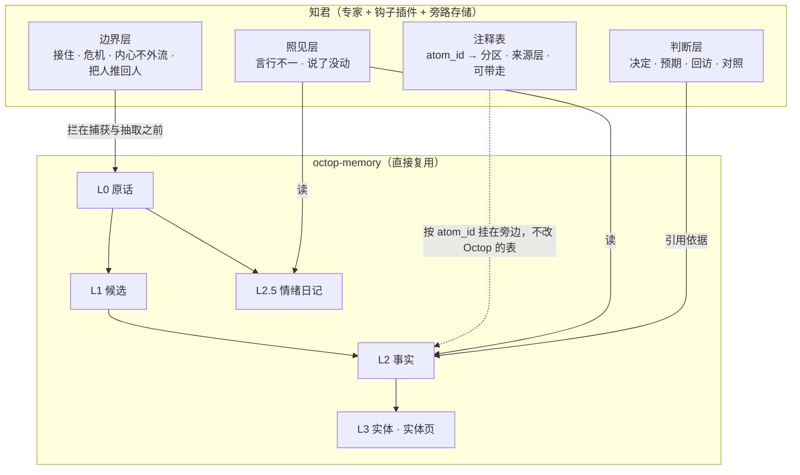

# 知君 on Octop · 设计

版本：2026-10-02 · 依据：读 `TencentCloud/Octop`（1.0.2b5，`e473dd3`）与 PyPI `octop-memory` 1.0.0 源码
配套：[产品愿景](ZHIJUN_VISION.md)、[产品需求 V2](ZHIJUN_PRD_V2.md)。本文**取代** [数据层](ZHIJUN_DATA_MODEL.md) 中关于「L0–L4 由知君自建」的全部章节。

---

## 0. 先纠正一个判断

此前根据报道与 README，我认为 Octop 的记忆「只是文档检索，没有关于一个人的断言、没有证据链、没有信任状态」。**读完源码，这是错的。**

`octop-memory` 是一套分层、有证据链、可审计的事实记忆，和知君自建的那一套**几乎同构**，有几处还更严：

| 层 | Octop（`octop_memory/types.py`） | 要点 |
|---|---|---|
| L0 | `RawEvent` | 不可变、只追加；**更正靠追加新事件，从不改旧事件** |
| L1 | `Candidate` | 模型抽出的候选，状态 `pending / promoted / rejected / needs_review / conflict`，带置信度与重要度 |
| L2 | `AtomCard` | 晋升后的规范事实，**只追加加弃用**（`superseded_by` / `deprecated_at`），永远能回溯到原话 |
| L2.5 | `Episode` + `DigestRecord` | **情绪与情境日记**：情绪、1–5 强度、涉及的人、话题、原话；按日 / 周 / 月汇成摘要 |
| L3 | `Entity` + `Alias` + `EntityPage` | 实体与别名；每个实体一页由模型编译的 Markdown（Karpathy llm-wiki 的做法），用户手写的「My Notes」重编译时原样保留 |
| L4 | `JournalEntry` | 所有变更的只追加审计，带 before / after |

比知君严的三处：

- **防稀释**：重要度为 high 时，断言必须**逐字等于**原话，禁止改写；否定与限定词（不 / 先 / 暂）任何重要度下都必须保留。
- **ID 由程序分配**，不由模型生成——模型无法虚构一个实体引用。
- **记忆按 Agent 隔离**：命名空间是 `agent_{agent_id}`（`octop/infra/agents/memory/backend.py`）。

**这改变了设计的出发点：知君不该再造记忆底座。**

## 1. 一句话架构

**Octop 管「记得什么」，知君管「这意味着什么、该不该说、能不能出去」。**

知君从此是一层薄而有主张的东西，坐在 `octop-memory` 之上，只做三件 Octop 没有、且做反了的事：

1. **判断层**——判断价值的载体
2. **照见层**——内观的载体
3. **边界层**——情绪价值能成立的前提



## 2. 知君概念 → Octop 原语

| 知君 | Octop | 做法 |
|---|---|---|
| 对话原话 | `RawEvent` | **直接用** |
| 工作理解 | `Candidate` | **直接用** |
| 已确认理解 | `AtomCard` | **直接用** |
| 撤回 / 取代、撤回的永不回流 | `superseded_by` / `deprecated_at` | **直接用**；召回默认已排除弃用事实 |
| 证据链、引用原话 | `raw_event_ids` / `quote_event_id` | **直接用** |
| 实体与别名、合并候选 | `Entity` / `Alias` / `merge_entity` | **直接用** |
| 复核事件 | `JournalEntry` | **直接用** |
| 冲突（两条事实矛盾） | `ConflictCandidate` | **直接用** |
| 八分区、四层来源、可带走开关 | 无 | **知君注释表**（见 3.4） |
| 心里的事 | `Episode`（大部分） | **用，但必须经边界层**（见 3.3） |
| 我眼中的我 | 无 | 用户实体上的事实 + 注释表打标 |
| 核心画像 | `EntityPage`（每个实体一页，模型编译） | **不直接用于提示词**：知君仍用确定性、按预算、过滤后的一页（见 3.4） |
| 判断簿、预期、回访 | 无（`Decision` 只是候选类型） | **知君自建**（见 3.1） |
| 照见、张力 | 无 | **知君自建**（见 3.2） |
| 主动开口 | `infra/proactive`（情绪日记关怀推送） | **替换挑选规则与出口**（见 3.3） |
| 人格 | `SOUL.md` | **直接用**，接住与危机两段写进去 |

## 3. 知君自建的三层

### 3.1 判断层（判断价值）

Octop 会把「我决定了 X」记成一条 `Decision` 候选，到此为止。知君要的是闭环：

| 对象 | 内容 |
|---|---|
| 决定 | 选了什么、依据了哪几条事实（`atom_id` 列表）、当时的把握 |
| 预期 | 用户写下的、可回头对照的预期 |
| 回访 | 约定的时间；到期由知君主动开口 |
| 对照 | 结果回来后，预期与结果并排；用户指出哪条理解需要改，走 Octop 的取代（`replace_atom`） |

**这是整个知君最不可替代的一块。** 只有它让「越来越懂你」变成可证伪的数字（预测命中率、纠正率下降）。

### 3.2 照见层（内观）

两种张力，都读 Octop 的数据、写知君自己的表：

- **言行不一**：「我眼中的我」里的自我评价 × 用户实体上「被观察到」的行为事实。配对后走模型判定，矛盾才成一条照见。
- **说了没动**：同一件心里的事在情绪日记里反复出现（次数 ≥ 3、跨度 ≥ 30 天）× 相关实体上没有新的事实或决定。**按实体判，不按词面**——中文分词会把「林岚」和「林岚谈」切开。
  这一条现在能做得比自建版更好：Octop 的 `Episode.people` 与按实体组织的 `AtomCard` 正好就是判断「相关的地方有没有进展」所需的两样东西。

措辞规则不变：第一句永远是观察，不是评价；并排两件事，不下结论。

### 3.3 边界层（三处必须覆盖 Octop 的默认行为）

**这一节是迁移后最先要做的事。** Octop 的情绪日记能力强，但在三处与知君的原则正面相反：

#### ① 情绪日记会把危机记下来

`pipeline/episode/prompts.py` 的提取器**明确要求**提取「焦虑、健康担忧、对自己人生的强烈感受、话语背后的隐含情绪」，强度 5 定义为「压倒性的」，**没有任何危机排除**。日记还会按天汇成 Markdown 写到 `<workspace>/journals/<日期>.md`。

`octop-memory` 自带的隐私配置只有 `redact_secrets` 与 `redact_patterns`（正则替换），**表达不了「这一轮不进记忆」**。

所以知君必须在调用方拦：

| 这一轮 | 处置 |
|---|---|
| 危机 | **不进 `octop-memory` 的捕获**。对话记录由 Octop 的会话历史保留，记忆系统里不留任何痕迹：不成候选、不成日记、不进摘要文件 |
| 重话 | 进捕获（原话要留），但**本轮不抽取**；用户继续说下去或明说「记下来」再抽 |
| 普通 | 照常 |

判定沿用知君已有的 `disclosure.py`（纯本地正则，不依赖模型自觉）。

#### ② 主动关怀会优先提起最糟的时刻

`infra/proactive/picker.py` 给日记打分：`强度 × 情绪权重 × 新近度`，**负面情绪权重 1.5 倍**。最近一条强度 5 的负面日记得分最高。如果 ① 没拦住，**一次危机袒露会成为它最优先主动提起的内容。**

知君用自己的规则替换挑选器，保留 Octop 的调度器与推送通道：

- 危机内容不存在于记忆里（① 保证），所以无从提起
- 重话在用户主动回来之前不主动提
- 照见与回访优先于情绪关怀；同一套节律配额，宁可少说
- 把人推回人：困扰指向**具体的人**时，多说一句「这件事你真正要谈的人可能是某某，不是我」

#### ③ 关怀消息走 IM 出门

`ProactiveCareService` 生成一条 ≤200 字的关怀消息，**经网关推到微信、飞书、QQ**。对知君来说这是一条出门通道：心里的事一旦写进微信消息，就经过了别人的服务器，也可能出现在锁屏上。

规则：**推送里不出现心里的事与我眼中的我的任何内容**，只说「有件事想和你聊，回来找我」；具体内容只在盒子自己的界面里展开。这是 C7「内心不外流」在 Octop 上的新落点。

### 3.4 注释表与核心画像

`AtomCard` 没有元数据字段，知君**不改 Octop 的表**，而是另建一张按 `atom_id` 挂的注释表：

| 字段 | 含义 |
|---|---|
| `atom_id` | 指向 Octop 的事实 |
| `section` | 八分区之一（我是谁 / 重要的人 / 正在做的事 / 我的原则 / 相处方式 / 我要去哪 / 心里的事 / 我眼中的我） |
| `layer` | 你告诉我的 / 资料里看到的 / 我推测的 / 你想成为的 |
| `takeaway` | `on / off / unset`；内观两分区恒为不可带走 |

核心画像仍由知君**确定性生成**，不直接拿 `EntityPage`：实体页是模型编译的长文，会把心里的事也写进去，而核心画像要按预算裁剪、按出口过滤、每轮可复现。

## 4. 在 Octop 里的形态

```
知君 = 一个专家 + 一个钩子插件 + 一张旁路存储
```

| 部件 | Octop 机制 | 承担 |
|---|---|---|
| 专家 `zhijun/` | 专家目录（`SOUL.md` / `IDENTITY.md` / `USER.md` / `HEARTBEAT.md` / `manifest.json`） | 人格（含接住与危机两段）、身份、主动节律 |
| 钩子插件 | `AgentMiddleware`，`before_model` / `after_model` | 每轮分级判定；注入核心画像与接住 / 危机指令；拦捕获与抽取 |
| 旁路存储 | 知君自己的 SQLite | 注释表、判断簿、照见、提及计数 |

**不 fork `octop-memory`。** 所有知君特有的东西都挂在旁边，Octop 升级时知君不用跟着改记忆底座。

## 5. 知君与其他专家：唯一认识你的那个

Octop 的记忆按 Agent 隔离。这既是好事也是缺口：

- **好事**：知君的心里的事天然不会被「老钱」或「育儿助手」读到。
- **缺口**：别的专家不知道你是谁，知君也学不到你跟它们聊了什么。

设计：**知君是唯一持有完整理解的专家**；其他专家只拿一份经知君过滤的投影——没有心里的事、没有我眼中的我、没有标了不可带走的条目。

Octop 已有先例：内置的临床学习订阅专家会「从结构化状态重新渲染 `USER.md`」。知君可以用同样的方式给每个专家渲染一份过滤后的 `USER.md`。

这正是原 MCP 契约里「其他 AI 借用这份认识」——只是「其他 AI」现在就在同一个盒子里，不必走网络协议。

## 6. 知君自己的代码里可以删的

`octop-memory` 已经覆盖、知君不必再维护的：`ontology_store` 的理解 / 证据 / 实体 / 复核事件，`extract.py` 的候选抽取，`consolidate.py` 的冲突与合并，`memory_retrieval.py` 的召回。

这就是 PRD 里「57 张表收敛到约 15 张」那个目标——不是靠重构，是靠交给 Octop。

**保留**：`disclosure.py`、`persona.py` 的接住与危机两段、判断簿、照见、`burdens.py` 的提及计数、核心画像的确定性生成。

## 7. 还没核实的三件

| 问题 | 为什么重要 | 怎么核 |
|---|---|---|
| `octop-harness` 是否在每轮**自动**调用捕获，以及中间件能否在捕获之前拦住 | 决定 3.3 ① 落在中间件里还是要包一层 | 读 `octop-harness` 的轮次生命周期 |
| 一个专家能否写另一个专家工作区里的 `USER.md` | 决定第 5 节的投影能否直接用文件做 | 读工作区权限与 `publish.py` |
| 日记摘要文件 `journals/*.md` 能被谁读 | 它们是普通 Markdown 文件，若同用户的其他专家能读，就是一条 C7 漏点 | 读工作区隔离 |

## 8. 对护城河的修正

此前我认为知君不可复制的是「断言层」。**Octop 已经有断言层**，而且是 MIT 开源的，任何人都能用。

所以知君的护城河要上移到这三层：**判断层**（有看法、记得为什么、回来对照）、**照见层**（指出你说的和做的对不上）、**边界层**（什么时候不记、什么时候不说、什么时候让你去找人）。

前两层任何人在 Octop 上都能做，所以护城河是执行和口味，不是数据架构。第三层更难——Octop 自己在三处做反了，说明这不是顺手会做对的东西。
