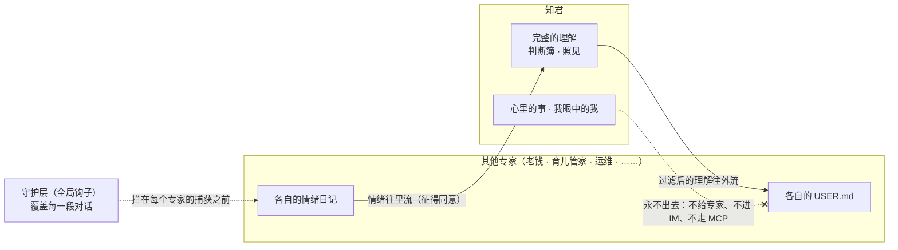

# 知君 on Octop · 设计

版本：2026-10-02 · 依据：读 `TencentCloud/Octop`（1.0.2b5，`e473dd3`）与 PyPI `octop-memory` 1.0.0 源码
配套：[产品愿景](ZHIJUN_VISION.md)、[产品需求 V2](ZHIJUN_PRD_V2.md)。本文**取代** [数据层](ZHIJUN_DATA_MODEL.md) 中关于「L0–L4 由知君自建」的全部章节。

---

## 0. 一句话

**在 Octop 上，知君不该是「又一个专家」，而是两样东西：一层覆盖全家所有 AI 的守护，加一个唯一认识你的知己。**

Octop 管「记得什么」，知君管「这意味着什么、该不该说、能不能出去」。

## 1. 为什么是两样东西

### 1.1 一个人崩溃的时候，不会挑哪个 AI 去说

Octop 是一屋子专家：证券的「老钱」、育儿管家、运维工程师、通用助手……用户凌晨两点在大跌之后对老钱说「我真的撑不住了」，这句话不会因为他没去找知君就变得不重要。

而 Octop 在情绪安全上**一片空白**：

- 每个专家的情绪日记提取器都会把这句话原样记下（见 3.1）。
- 每个专家的主动关怀都会优先提起它（见 3.2）。
- Octop 自带的「AI 安全合规卫士」管的是**信息安全**：注入检测、危险命令、数据出境。它对情绪只字未提，还有一条规则是「审计日志保留原始个人信息、不脱敏、留存六个月以上」——对心里话，这正好相反。而且它只是一个专家，只在自己的对话里生效。

所以知君的边界规则**不能只装在知君自己身上**。它要做成全局钩子插件，覆盖这台盒子上这个用户的每一段对话。Octop 的机制本来就支持：全局启用的插件，其中间件会挂到所有 Agent 的调用链上。

### 1.2 只有一个 AI 应该看见完整的你

专家们各管一个领域，记忆按 Agent 隔离（命名空间 `agent_{agent_id}`）。没有任何一个专家知道「你是谁」。

知君的位置就是那唯一的一个：持有对这个人的完整理解、判断簿、照见。

## 2. 一条流向原则

```
情绪往里流，理解往外流，心事不出去。
```



| 方向 | 什么 | 规则 |
|---|---|---|
| **往里** | 其他专家对话里的**情绪日记**（只有感受，不含领域事务） | 用户同意后才汇入；知君显示「这一条来自你和老钱的对话」 |
| **往外** | 知君对你的**外向理解**（我是谁、原则、相处方式、方向……） | 渲染成每个专家的 `USER.md`；按可带走规则过滤 |
| **永不出去** | 心里的事、我眼中的我、危机内容 | 不进任何专家、不进 IM 推送、不走 MCP |

往外那一条，Octop 已有先例：内置的临床学习订阅专家会「从结构化状态重新渲染 `USER.md`」。这也就是原 MCP 契约里「其他 AI 借用这份认识」——只是「其他 AI」现在就在同一台盒子里。

**但投影不能写进 `USER.md`。** Octop 的专家发布（`infra/agents/experts/publish.py`）是白名单：根目录只放行 `SOUL.md` / `IDENTITY.md` / `USER.md`，外加 `skills/` 与 `agents/*.md`，`memory.sqlite` 单独排除，`journals/` 等其余路径一律不带。白名单本身设计得很干净，**问题在于 `USER.md` 在白名单里**：知君若把用户画像写进某个专家的 `USER.md`，用户一旦发布这个专家，画像就跟着走了。

所以投影要写到白名单之外的文件，并由钩子在每轮注入，而不是依赖专家自己读 `USER.md`。把画像带出去应该永远是一个单独的、明确的动作，不能是发布专家时的副作用。

## 3. 必须覆盖 Octop 默认行为的四处

前三处是安全问题，第四处是认知问题。**守护层与这四处覆盖，是迁移后最先要做的事。**

### 3.1 情绪日记会把危机记下来

`pipeline/episode/prompts.py` 的提取器**明确要求**提取「焦虑、健康担忧、对自己人生的强烈感受、话语背后的隐含情绪」，强度 5 定义为「压倒性的」，没有任何危机排除。情绪日记会进入自动提取链路。

（2026-10-02 更正：此前写成「日记还会按天自动汇成 Markdown」，说过头了。Markdown 摘要只有在显式调用摘要生成并指定目录时才会写出，Octop 主仓里没有自动调度它。GPT 在 0.4.2 上核实了这一点。）

**0.4.2 实测**（GPT 用固定模型输出做的合成验证）：一条危机材料被保存为 1 个候选、1 个事实、1 个情绪日记。这证明程序允许这条路径；真实模型每次是否提取另需验证。

`octop-memory` 的隐私配置只有 `redact_secrets` 与 `redact_patterns`（正则替换），**表达不了「这一轮不进记忆」**。

| 这一轮 | 守护层的处置（对所有专家生效） |
|---|---|
| 危机 | **不进 `octop-memory` 的捕获**。会话历史保留原话，记忆系统里不留痕：不成候选、不成日记、不进摘要文件 |
| 重话 | 进捕获，但**本轮不抽取**；用户继续说或明说「记下来」再抽 |
| 普通 | 照常 |

判定沿用 `disclosure.py`（纯本地正则，不依赖模型自觉）。

### 3.2 主动关怀会优先提起最糟的时刻

`infra/proactive/picker.py` 打分 = `强度 × 情绪权重 × 新近度`，**负面情绪权重 1.5 倍**。最近一条强度 5 的负面日记得分最高——如果 3.1 没拦住，一次危机袒露就是它最优先主动提起的内容。

知君替换挑选规则，保留 Octop 的调度器：危机内容不存在于记忆里；重话在用户主动回来之前不提；照见与回访优先于泛泛的关怀；同一套节律配额，宁可少说；困扰指向**具体的人**时，多说一句「这件事你真正要谈的人可能是某某，不是我」。

### 3.3 关怀消息走 IM 出门

`ProactiveCareService` 生成 ≤200 字的关怀消息，**经网关推到微信、飞书、QQ**。心里的事一旦写进微信消息，就经过了别人的服务器，也可能出现在锁屏上。

规则：推送只敲门，不带内容——「有件事想和你聊，回来找我」。内容只在盒子自己的界面里展开。

### 3.4 候选默认全部晋升为事实

`pipeline/promotion/checks.py` 的设计是「只降级哲学：每个候选默认都变成事实」，偏离默认的情况只有低重要度加低置信度时丢弃、与已有事实相同时合并、与已有事实矛盾时转人工，此外还有证据检查。而它定义的低置信度包括：用户没明确接受的助理建议、假设语气、转述别人的话。**这类内容只要重要度不是低，就会成为规范事实。**

（2026-10-02 更正：此前写成「候选默认全部晋升」，忽略了上面这几道检查，说过头了。）

**0.4.2 实测**：一条用户没认可的助理建议被晋升为事实、能被原生搜索检出；知君的个人本体用「本人原话」过滤挡住了它，**但回答仍能直接调用原生记忆搜索，那条路径没有同样的过滤**。

这是知君「你说了算」与「推测必须标明」的正面反例，对「我眼中的我」尤其危险——替人断定他怎么看自己，越界且几乎必错。

`octop-memory` 的配置有 `extraction.promote` 开关。知君把它关掉，自己定晋升：**只有逐字的、用户亲口说的事实自动晋升**（这与知君 V3 的「亲口说的精确引用直接记住、可撤回」一致）；推测一律停在候选、标「我推测的」、等用户点头。

## 4. 知君概念 → Octop 原语

`octop-memory` 是一套分层、有证据链、可审计的事实记忆，和知君自建的那套几乎同构，有三处更严：高重要度断言必须逐字等于原话、否定词必须保留、ID 由程序分配而非模型生成。**所以知君不再造记忆底座。**

| 知君 | Octop | 做法 |
|---|---|---|
| 对话原话 | `RawEvent`（不可变、只追加） | 直接用 |
| 工作理解 | `Candidate` | 直接用；晋升由知君定（3.4） |
| 已确认理解 | `AtomCard`（只追加加弃用） | 直接用 |
| 撤回的永不回流 | `superseded_by` / `deprecated_at` | 直接用 |
| 证据链 | `raw_event_ids` / `quote_event_id` | 直接用 |
| 实体与别名 | `Entity` / `Alias` | 直接用 |
| 复核事件 | `JournalEntry` | 直接用 |
| 八分区、四层来源、可带走 | 无（`AtomCard` 没有元数据字段） | **知君注释表**，按 `atom_id` 挂，不改 Octop 的表 |
| 心里的事 | `Episode` | 用，但必须经守护层 |
| 我眼中的我 | 无 | 用户实体上的事实 + 注释表打标；**只认原话** |
| 核心画像 | `EntityPage`（模型编译的长文） | 不直接进提示词：仍由知君确定性生成、按预算、按出口过滤 |
| 判断簿与回访 | 无（`Decision` 只是候选类型） | **知君自建** |
| 照见 | 无（只有事实与事实的冲突） | **知君自建** |
| 人格 | `SOUL.md` | 直接用，接住与危机两段写进去 |

## 5. 知君自建的三样

**判断簿**：决定、依据的事实（`atom_id`）、当时的把握、写下的预期、约定的回访时间；结果回来后并排对照，用户指出哪条理解要改，走 Octop 的取代。**这是整个知君最不可替代的一块**，只有它让「越来越懂你」可证伪。

**照见**：言行不一（我眼中的我 × 被观察到的行为）；说了没动（同一件心里的事反复出现 ≥ 3 次、跨度 ≥ 30 天，相关实体上没有新事实或决定）。按实体判，不按词面。第一句永远是观察，不是评价。汇入其他专家的情绪日记之后，照见能做得比以前更深：「这周你和老钱聊了三次大跌，都在夜里十一点之后。」

**注释表**：`atom_id → section / layer / takeaway`。内观两分区恒为不可带走。

## 6. 形态与入口

```
知君 = 一个全局钩子插件（守护层）+ 一个专家（知己）+ 一张旁路存储
```

| 部件 | Octop 机制 | 作用范围 |
|---|---|---|
| 守护层 | 全局启用的 `AgentMiddleware`（`before_model` / `after_model`） | **这个用户的所有专家** |
| 知己 | 专家目录（`SOUL.md` / `IDENTITY.md` / `USER.md` / `HEARTBEAT.md` / `manifest.json`） | 知君自己 |
| 旁路存储 | 知君自己的 SQLite | 注释表、判断簿、照见、提及计数 |

**不 fork `octop-memory`。**

**入口：知君不该出现在专家列表里，排在老钱旁边。** 那会把它压扁成「又一个助理」——正是新定位要避免的。对选择了知君的用户，打开盒子先见到知君；专家们是知君可以引荐的专业服务。知君按人开，不按户开：一家人里，可能只有那个独自做决定的大人需要它。

## 7. 被取代的东西

Octop 已经能在任何地方跑（pip、Docker、桌面安装包、NAS 原生应用），所以过去几周做的这些**不再需要**：独立运行模式、本机模式的壳（`newzhijun-local` 分支）、盒端解耦、模型缓存目录、数据文件夹、把 MCP 当作对外协议（同一盒子里的专家改用 `USER.md` 投影）、知君自建的整套数据层。

**留下来的**：`disclosure.py`、`persona.py` 的接住与危机两段、判断簿、照见、`burdens.py` 的提及计数、核心画像的确定性生成、内心不外流的规则，以及产品判断本身。

## 8. 建造顺序

| 顺序 | 做什么 | 为什么先做 |
|---|---|---|
| 1 | **守护层** + 3.4 关掉自动晋升 | 安全问题；而且知君这个专家还不存在时，它就已经在保护每一段对话 |
| 2 | 知己专家：`SOUL.md` + 核心画像注入 + 入口 | 让知君先能「接住」与「记得」 |
| 3 | 判断簿与回访 | 最不可替代的价值，要尽早开始积累 |
| 4 | 照见 | 需要积累出来的数据，自然靠后 |
| 5 | 情绪往里流、理解往外流 | 依赖第 9 节两件尚未核实的事 |

## 9. 还没核实的

| 问题 | 决定什么 |
|---|---|
| `octop-harness` 是否每轮自动捕获，中间件能否拦在捕获之前 | 守护层最要紧的那件事落在中间件里，还是要包一层 |
| 知君能否只读其他专家的记忆命名空间 | 「情绪往里流」能否实现 |
| 钩子能否在每轮为任意专家注入一段上下文 | 「理解往外流」的落点（已确认不能写进 `USER.md`，见第 2 节） |
| 日记摘要文件 `journals/*.md` 能被同用户的其他专家读到吗 | 发布时不会带出去（已核实，白名单之外）；但同盒子内的读取权限仍未核实 |

## 10. 护城河

断言层 Octop 已经有，而且 MIT 开源，谁都能用。知君的护城河在三处：

- **判断**：有看法、记得为什么、回来对照。
- **照见**：指出你说的和做的对不上。
- **守护**：什么时候不记、什么时候不说、什么时候让你去找人。

前两样任何人在 Octop 上都能做，拼执行与口味。第三样最难，Octop 自己在四处做反了。它也是盒子相对「NAS + Octop」最具体的差异：**这台盒子上的每一个 AI，都知道什么时候该停下来。**
