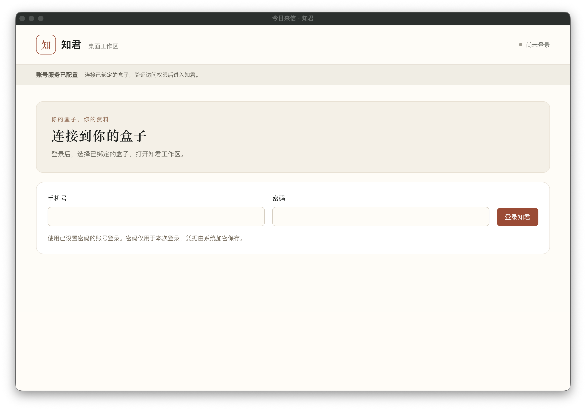

# 完整产品硬件与发布复核

日期：2026-09-06。本文区分真实机器上的隔离能力验证与正式账号的完整 UI/SDK 验收。后者仍需生产 Admin 登记 `zhijun-desktop / zhijun.workspace`，不能用临时测试证明替代 Consumer 授权。

## 桌面启动

用户截图中的 `setName` 异常来自已删除的临时 `zhijun-speech-probe`：该脚本把 Electron npm 包导出的可执行文件路径误当成主进程 API。临时进程已停止，未将其并入产品。实际启动器会清除 `ELECTRON_RUN_AS_NODE`，通过 Electron 可执行文件加载产品入口。

本次还修复了 v1 配置阻碍升级的问题：默认准备及启动使用 `data/desktop/zhijun-product-v2.json`，保留旧文件；用户显式设置 `ZHIJUN_DESKTOP_CONFIG` 仍有效，不覆盖已有不同内容。配置文件的 schema version 仍为 1，文件名 v2 指新的工作区应用合同。

运行 `rtk proxy bash start-desktop.sh --real` 后，桌面构建通过，实际 Electron 主进程和 renderer 持续运行。macOS 窗口标题为“今日来信 · 知君”，显示真实登录页，无异常弹窗。页面尚未登录，不代表盒子连接、导航内业务或完整验收已通过。

## 隔离盒端环境

- 原用户服务继续使用 `127.0.0.1:8618`，健康检查 200；其数据根未切换。
- 候选代码、合成文件和测试记录位于 `/home/user/apps/centuarai-data-engine/acceptance-0906/`；隔离完整服务监听 `127.0.0.1:18618`。
- 临时 Ed25519 测试密钥只用于隔离服务，未读取或替换 live Agent 私钥。无证明请求的 context 返回 401。
- 使用盒子实际 Python 3.14、ffmpeg/PyAV、OCR、faster-whisper 和本地 Ollama。测试语音由 macOS TTS 合成，未采集麦克风。
- 完整候选包来自 `scripts/build-full-product-release.py`，有逐文件 hash、源码 HEAD/dirty 状态及归档回执；测试中发现的补丁单独记录，最终发布前须重新生成一致的工件。

## 真实能力复测

| 项目 | 当前证据 | 状态 |
| --- | --- | --- |
| PDF | 真实解析 868 字节文件，提取 46 字符 | 通过 |
| Word | 真实 DOCX 解析，提取 48 字符 | 通过 |
| 图片 OCR | 24,316 字节合成图片，识别 110 字符 | 通过 |
| 语音转写 | 真实 voice API 转写 40 字符、2 个指定短语全匹配、未产生资料记录；独立推理峰值 RSS 1,170,724 KiB | 通过 |
| 上传→快照→脱敏→本地摘要/实体 | 正文脱敏后 82 字符、摘要 43 字符、2 个实体；原始手机号未出现在结果中 | 通过 |
| HTTP v2→Gateway→UDS→反向 DE | 10 组验收全部通过，60 次请求、21 个完成操作，含知识创建/编辑/确认/搜索/清除 | 通过 |

初轮 ASR 失败为原生线程数导致 `mkl_malloc` 在 4 GiB 地址空间限制内失败，之后发现推理阶段仍需单线程及受控内存分配。修复保持 4 GiB 限制，限制仅作用于一次性解析进程；推理异常和无语音现在分别处理。修复后的完整 voice API 已通过；该证据使用合成语音，不代表实际麦克风采集已验收。

小文档的 `storage_state=ready` 与 `parse_status=ok` 不足以通过隐私门禁。旧 saga 对内联正文保存空 `snapshot_hash`，实际 privacy source 返回 `REDACTION_SNAPSHOT_UNAVAILABLE`。修复在快照提交事务中计算/校验真实正文 SHA-256，并仅为已有 ready 内联正文补齐缺失值；不伪造外部文件哈希，不改已有非空摘要值。

DeletionStore 高频权限检查也发现原生 SQLite 上下文不关闭连接；保持查询、提交/回滚和权限规则，用 `closing` 确定释放。禁用 GC 的 100 次真实检查 FD 保持 4→4，相关回归通过。其后真盒分析原数据库异常消失，但未取得旧异常的 message，不将相关性写成唯一已证根因。

连续知识操作暴露包 `dispatch` 函数被同名子模块首次导入覆盖的问题。提前加载私有实现后，两个新进程回归由失败变为通过；真盒 10 组 HTTP 验收全部通过。资料分析另一次真实小 Qwen 输出不满足原文证据规则，已增加仅针对结构/证据错误的至多一次纠错重试；每次保留主体、来源、隐私与配置复核。最终五项硬件脚本全部通过，失败历史保留；模型两次仍不合规会明确失败。

结构化原始证据：[5 项能力](evidence/hardware-candidate5.jsonl)、[10 组 HTTP 链路](evidence/gateway-candidate6.jsonl)。HTTP 测试只保留一个用于所有权隔离的合成会话哨兵；测试上传和知识均清理，未读用户资料。

## 跨模块配额复核

真实 JS 模块配合严格内存 Agent 配额的复现发现：200 MiB 上传在约 59 MiB 触发 120 次/分钟限制；持续 SSE 的立即轮询也会耗尽窗口。SDK/Agent 的 1024 次会话额度属于当前会话的硬上限。

已完成每会话统一请求调度、心跳优先级、明确限流/重新连接提示、上传编码后字节及请求数预留。117 项 Node 测试与前端类型检查通过，其中独立跨层 15 项包含在总数内。200 MiB、400 分片的完整链路虚拟耗时 243 秒，滚动 60 秒最多 101 次请求。虚拟时钟下的大上传与持续流测试用于验证调度和错误语义，不能标为真实 SDK/P2P 大文件验收。派发后的不确定写入保持未知状态，不自动重放业务写入。

## 发布及剩余验收

已推送：桌面/领域代码 `58dac31`、DE 完整能力 `015c659`、Agent `5f5f4c9`、Admin `44a0950`。DE 独立 FD 热修 `132b97d` 已部署，见 [连接泄漏报告](CONNECTIVITY-FD-HOTFIX-0906.md)。完整 v2 已匹配部署到正式盒端，源版本、备份和回执见[部署报告](FULL-PRODUCT-DEPLOYMENT-0906.md)。

上述盒端隔离硬件复测及匹配部署已完成。仍需发布 Admin 新应用登记，再使用正式账号逐项执行 [完整产品验收矩阵](../development/FULL-PRODUCT-ACCEPTANCE-0906.md)。170 项操作清单不等于 170 项 UI 实测。

生产 Admin 发布入口尚缺：仓内只找到 `admin-backend/scripts/run.sh` 的通用启动方式，未找到 `boss.nexusaos.qitus.cn` 对应的发布任务、SSH 主机及实际部署目录。Gateway 部署脚本属于独立服务，不能据此推断 Admin 主机。
